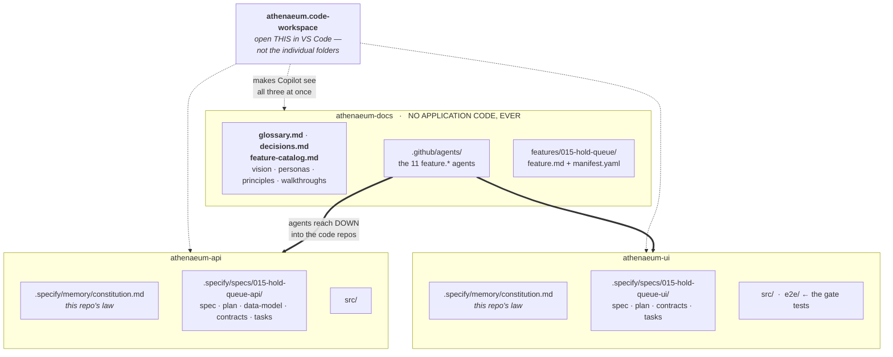
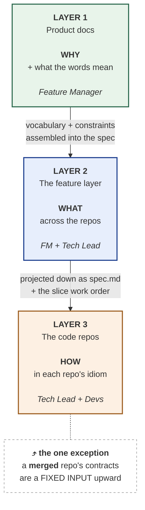
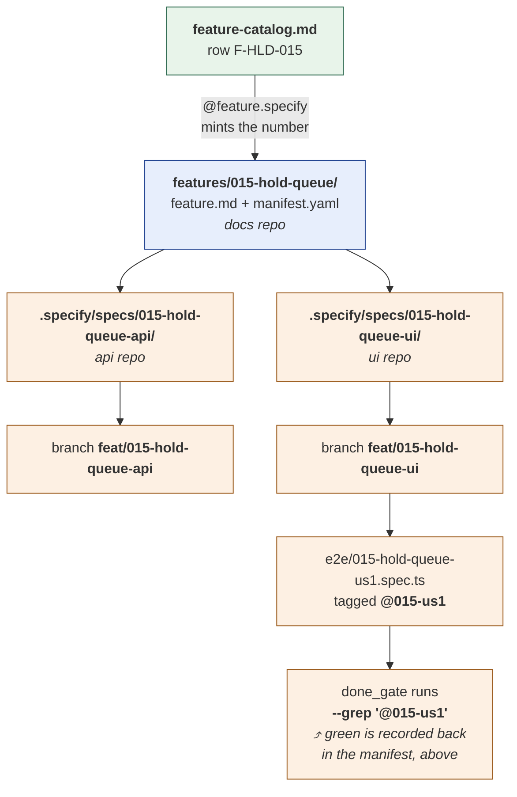

# 03 — Structure

> **Read this if** you need to set up the folders, or you're trying to work out where a given file
> belongs.

---

## The workspace on disk

Three repos, siblings, flat. Plus one file at the top that is easy to overlook and load-bearing:



**Why the `.code-workspace` file matters more than it looks.** Copilot sees your *workspace*. Open one
repo and it cannot see the others — so it cannot reconcile a contract, project a spec into two repos,
or run a test in one repo against a service in another. Every cross-repo thing in this playbook
depends on that one file. See [05 — Setup](05-copilot-setup.md#step-5--the-multi-root-workspace-this-is-the-important-one).

---

## Three layers

Everything lives in one of three layers, and the layer decides who owns it and what question it
answers:



**Layers 1 and 2 both live in the docs repo.** That's deliberate — coordinating work across repos is
a job that can only be done from somewhere above them.

Layer 2 is the one stock Spec Kit doesn't have. It is thin on purpose — **two files per feature** —
because every line you put there is a line that can drift from the repos below it.

Information flows **down** — except for one thing, and it's the single most commonly violated rule in
the playbook. Once a repo has merged its half, its real contracts stop being something the layer
above gets to decide and become a fixed input it must conform to. **The merged contract always
wins.** You change the plan; you never change the shipped code to match a document.

---

## Layer 1: the product docs repo

One repo. No application code. It holds the vocabulary and the intent that every other repo consumes.

```
<product>-docs/
├── README.md                 the reading order, and why it's that order
│
├── vision.md                 why the product exists          ─┐ narrative:
├── personas-and-jobs.md      who it's for, and their jobs      │ read once,
├── product-principles.md     what you'd say no over (P-01, …) ─┘ changes quarterly
│
├── feature-catalog.md   ★    the backlog — every request      ── live: changes daily
│
├── glossary.md          ★    THE canonical vocabulary        ─┐ reference: looked up
├── decisions.md         ★    the decisions, with the why      ─┘ constantly, never read through
│
├── walkthroughs.md           end-to-end narratives            ── examples
│
└── features/                 ← layer 2 lives here
    ├── _template/manifest.yaml
    └── 015-hold-queue/       ← numbered, and the number does real work
```

### Why the docs have no numbers and the features do

This trips people up, so it's worth being explicit. The rule is:

> **Number the things you have many of. Name the things you have one of.**

There is exactly **one** glossary. Calling it `05-glossary.md` would add a digit that correlates
with nothing — it points at no other artifact, it isn't an identifier, it's a sort key. And it has
real costs: it has to be maintained, it's cited by name in every agent prompt, and it forces a
migration every time the set of documents changes. The only thing it buys is a suggested reading
order, and a `README.md` does that better because it can explain *why* that order. A filename can't.

The `015` in `features/015-hold-queue/` is the opposite — it earns its place several times over.
**Follow one number across the whole system:**



**That number is a cross-repo correlation key.** It's the thread tying a test tag in one repo back
to a spec folder in another, and it closes the loop when the gate reports green. Grep `015` and you
find every artifact belonging to this feature, in every repo, including the test that proves it.

There are many features and the number does work in every one of them. `05` on a glossary does none
of that.

Reading order isn't lost — it just moved to the docs repo's `README.md`, where it belongs. And note
that it is **not** a work order: when you set this up you write `glossary.md` first
([06 — Rollout](06-rollout.md)), long before there's a vision statement worth reading.

### Which of these the AI actually reads

Worth knowing precisely, because it tells you where accuracy is load-bearing:

| Document | Read by |
|---|---|
| `glossary.md` | **Agents, constantly** — the single most-loaded file in the system |
| `feature-catalog.md` | **Agents** — `@feature.specify` refuses to run on an incomplete row |
| `decisions.md` | **Agents** — constraining decisions get pulled into every spec and cited |
| `personas-and-jobs.md` | **Agents** — referenced personas are assembled into the spec verbatim |
| `product-principles.md` | **Agents** — a linked principle's full text goes into the spec |
| `vision.md` | Humans only |
| `walkthroughs.md` | Humans only |

The five the agents load are the ones where a sloppy sentence becomes a sloppy spec, then sloppy
code. The two humans-only files matter for a different reason: they're how a new joiner gets their
bearings before the reference material means anything. **Both readers are real** — just don't kid
yourself that a beautifully written vision statement improves what the model generates. It doesn't.
The glossary does.

> **Seven documents, and no more than that.** If you're porting an existing docs set, resist
> carrying over a `current-state.md`, a `target-state.md`, or a `roadmap.md` just because you have
> one. Nothing in this pipeline reads them, and **a document nothing references is a document nobody
> updates** — a stale doc in a repo whose entire claim is "source of truth" is worse than no doc at
> all. Add one the day something actually needs it.

The three starred files do the daily work.

**`feature-catalog.md` — the backlog.** Every feature request, in a fixed shape. A row must be
complete before it can be specified: user story, ≥3 Given/When/Then acceptance criteria, linked
principles, linked personas, out-of-scope, dependencies, status. Statuses run
`Idea → Ready-for-spec → Spec'd → In-progress → Shipped`.

**`glossary.md` — the vocabulary.** The most important file in the system. Every domain term,
every enum, every identifier, every state transition. **One name per concept, and no synonyms.**

Why this file matters more than it looks: an AI generating a spec will happily write `order` where
your glossary says `transaction`, then a developer will write an `OrderService`, and now your
codebase has two words for one thing and every future conversation carries a translation cost. It
compounds. This is the most common way spec-driven development quietly fails, and the glossary is the
only defence.

**`decisions.md` — the decisions. The reason this repo exists.**

Numbered, dated, and carrying the *reasoning* rather than just the ruling: *a Hold is placed on a
Title, never a Copy* (D-001), *policy values live in config* (D-002). Specs cite them by number.

This is the file that answers "why on earth is it done that way?" — and it answers it for two
different readers at once. **A person** joining the project reads it and learns not just what the
rules are but what each one was protecting against and what it traded away, which is what lets them
argue with a rule instead of nervously working around it. **The AI** reads it too: `feature.specify`
pulls every constraining decision into the feature spec automatically and cites it, so a plan
generated today honours a call made a year ago by someone who has since left.

It is **append-only**. You supersede, never delete — see the worked `D-004 → D-005` pair in the
starter kit, where the superseded entry stays *because* the reasoning that killed it is the valuable
part. And because specs cite decisions by number, when one is superseded you can find every spec
that assumed it. `feature.analyze` checks exactly that.

> **Why a separate repo? Three reasons, and the third is the one that matters.**
>
> **It stays honest.** Docs living in a code repo become *that repo's* docs. They drift into
> describing that service, and the API's copy and the UI's copy of "the truth" diverge inside a
> month. A repo with no code in it cannot quietly become one service's documentation.
>
> **It's citable.** Docs in their own repo can be pinned with a commit SHA —
> `source: <product>-docs@a1b2c3d` — so a spec names the exact version of the truth it was generated
> from. That's what makes regeneration reproducible rather than aspirational.
>
> **It outlives the code.** Services get rewritten, replaced, and deleted. The reasoning about
> *what the product is and why it works this way* is the asset that survives all of that — and if
> you keep it inside a service, you throw it away the day you retire the service. Give it somewhere
> to live that nothing is going to decommission.

---

## Layer 2: the feature folder

```
<product>-docs/features/015-hold-queue/
├── feature.md       ← ONE spec, for the whole feature, across all repos
└── manifest.yaml    ← the spine
```

**`feature.md`** is the cross-repo specification. Prioritised user stories with Given/When/Then, the
functional requirements, the key entities, the success criteria, the out-of-scope list, and the open
questions. It is assembled from layer 1 — the catalog row plus the *full text* of every linked
principle, persona, glossary row, and decision.

This replaces the "two sibling specs you keep in sync by hand" model, which does not work. One spec,
projected down.

**`manifest.yaml`** is the artifact polyrepo was missing.

---

## The manifest, field by field

This is the one file worth understanding completely. Everything else is documents; this is the thing
that makes the pipeline mechanical.

```yaml
feature: 015-hold-queue
title: Hold Queue
catalog_ref: F-HLD-015                # the row in feature-catalog.md
source: <product>-docs@a1b2c3d        # the exact docs version this was specified from

status: draft                         # draft → spec-signed-off → in-progress
                                      #       → signed-off → uat → shipped
spec: feature.md

# ─── The customer signed the WHAT. Gate 1. ───────────────────────────
spec_signoff:
  by: null                            # a real person's name
  at: null                            # ISO timestamp
  note: null                          # what they accepted, incl. what's out of scope

# ─── Which repos participate, and where each one stands ──────────────
repos:
  api:
    path: <product>-api
    spec: .specify/specs/015-hold-queue-api
    constitution: .specify/memory/constitution.md
    branch: feat/015-hold-queue-api
    state: new                        # new | specified | planned | in-progress | merged
    pr: null
  ui:
    path: <product>-ui
    spec: .specify/specs/015-hold-queue-ui
    constitution: .specify/memory/constitution.md
    branch: feat/015-hold-queue-ui
    state: new
    pr: null

# ─── Stories, slices, and the per-story gate ─────────────────────────
phases:
  - id: P1
    title: Joining and seeing the queue
    status: pending
    stories:
      - id: US1
        title: As a Reader, I want to place a Hold, so that I get the next Copy returned
        priority: P1
        slices:                       # THE WORK ORDER. api before ui, always.
          - { repo: api, tasks: T001-T009 }
          - { repo: ui,  tasks: T001-T006 }
        done_gate:
          status: pending             # pending → green → signed-off
          e2e: <product>-ui/e2e/015-hold-queue-us1.spec.ts
          e2e_tag: "@015-us1"         # the test selector
          last_run: null
        signoff:
          by: null
          at: null
          note: null

# ─── How to stand up the WHOLE system for the gate ───────────────────
compose:
  api:
    cwd: <product>-api
    cmd: "<your API run command>"
    health: "http://localhost:PORT/health"   # poll until 200 BEFORE testing
  workers:                            # background services — no port to poll
    - { name: projections, cwd: <product>-api, cmd: "<your worker command>" }
  ui:
    cwd: <product>-ui
    cmd: "<your UI run command>"
    url: "http://localhost:3000"
  e2e:
    cwd: <product>-ui
    cmd: "<your e2e command> --grep '@015'"

# ─── Append-only history. Every stage writes one line. ───────────────
log:
  - { at: "2026-07-01T10:00:00Z", phase: specify, by: feature.specify, note: "scaffolded" }
```

### The four fields that do the heavy lifting

**`state`** — per repo, and it's a dispatcher. It tells every later stage what to do with this repo:

| `state` | Meaning | Effect |
|---|---|---|
| `new` / `specified` | Needs planning | Plan it |
| `planned` / `in-progress` | Already has plan artifacts | Reconcile against it, **don't regenerate** |
| `merged` | **Shipped. Contracts are FROZEN.** | Read-only authority. Other repos conform to it. |

Getting this wrong either clobbers shipped work or duplicates a plan that already exists.

**`slices`** — the work order, api-before-ui. This is what makes a story vertical. Everything in the
inner loop reads exactly this.

**`done_gate`** — the per-story test gate. `e2e_tag` is the thread that ties an acceptance criterion
to a test. `status` moves `pending → green` (a machine, on a real run) `→ signed-off` (a human).

**`compose`** — the reproducible "stand up everything and test it" recipe. This exists because a
read-side feature is invisible to a test unless its background workers are running, and "it worked on
my machine because I happened to have the worker up" is not a process.

### Why the log matters

Every stage appends one line. It gives you a readable history without diffing anything:

```yaml
log:
  - { at: "2026-07-01T10:00:00Z", phase: specify,  by: feature.specify,  note: "scaffolded; repos: api, ui" }
  - { at: "2026-07-02T14:30:00Z", phase: signoff,  by: feature.spec-signoff, note: "spec signed by Dana Ortiz" }
  - { at: "2026-07-03T09:15:00Z", phase: plan,     by: feature.plan,     note: "2 repos planned; 1 contract mismatch" }
  - { at: "2026-07-05T16:45:00Z", phase: verify,   by: feature.verify,   note: "US1 gate @015-us1 GREEN" }
```

Six months later, that's how you find out what happened.

> **A YAML trap that will bite you:** always **quote ISO timestamps** inside `{ }` flow-maps. The
> colons in `10:00:00` break the parse otherwise. Write `at: "2026-07-01T10:00:00Z"`, not
> `at: 2026-07-01T10:00:00Z`.

---

## Layer 3: the code repos

Each code repo gets **its own Spec Kit install** and **its own constitution**:

```
<product>-api/
├── .specify/
│   ├── memory/constitution.md         ← THIS repo's rules
│   ├── templates/                     spec-template.md, plan-template.md, tasks-template.md
│   └── specs/
│       └── 015-hold-queue-api/
│           ├── spec.md         ← the WHAT (from the Feature Manager, stage 2)
│           ├── plan.md         ← the HOW (Tech Lead, stage 4)
│           ├── research.md
│           ├── data-model.md
│           ├── contracts/      ← what this repo EXPOSES
│           └── tasks.md        ← T001… (stage 5)
├── .github/
│   ├── copilot-instructions.md
│   └── prompts/                       ← Spec Kit's /speckit.* commands land here
└── src/
```

**The constitution is the repo's own law.** Test-driven development rules, naming conventions,
"never hard-code business values", "components must meet WCAG AA", "call the real API, never a
mock" — whatever this repo mandates. It is written once with `/speckit.constitution` and then it
governs every implementation in that repo.

This is the **DOWN** half of the organising rule from [01](01-why.md): the feature layer says *what*
and *in what order*; the constitution says *how*. Don't move constitution rules up — they're
different per repo, and that's correct.

### Naming conventions that pay for themselves

| Convention | Example | Why |
|---|---|---|
| Shared feature number across repos | `015-hold-queue-api`, `015-hold-queue-ui` | You can find every piece of feature 015 by grepping `015` |
| `-api` / `-ui` suffix | | Disambiguates the two installs at a glance |
| Branch = spec folder name | `feat/015-hold-queue-api` | The branch and the spec can never be mismatched |
| Test tag `@NNN-us{n}` | `@015-us1` | **The thread from acceptance criterion to test.** The gate is literally `--grep '@015-us1'` |

That last one is the one to internalise. It's how a sentence the customer signed in stage 3 becomes a
test that gates production in stage 7.

---

## The whole thing on disk

```
<workspace>/                          ← the folder that holds everything
├── <product>.code-workspace          ← VS Code multi-root file. See doc 05.
│
├── <product>-docs/
│   ├── vision.md … walkthroughs.md
│   ├── .github/agents/               ← the feature.* Copilot agents live here
│   └── features/
│       ├── _template/manifest.yaml
│       └── 015-hold-queue/
│           ├── feature.md
│           └── manifest.yaml
│
├── <product>-api/
│   ├── .specify/{memory,templates,specs}/
│   ├── .github/{copilot-instructions.md,prompts/}
│   └── src/
│
└── <product>-ui/
    ├── .specify/{memory,templates,specs}/
    ├── .github/{copilot-instructions.md,prompts/}
    ├── e2e/                          ← the gate tests
    └── src/
```

The repos are **siblings**. Every agent finds its bearings by walking up the tree until it sees them
all next to each other — that folder is `<workspace>`. Keep them flat.

> **Watch out if a repo is nested.** If your frontend app lives in a subfolder (`<product>-ui/App/`),
> then Spec Kit installs at `<product>-ui/App/.specify/` but **git branches are still cut at
> `<product>-ui/`**. Those two paths differ and mixing them up is a genuinely common, genuinely
> annoying bug. Write the real paths into the manifest and let it be the authority.

---

Next: [04 — Roles](04-roles.md)
